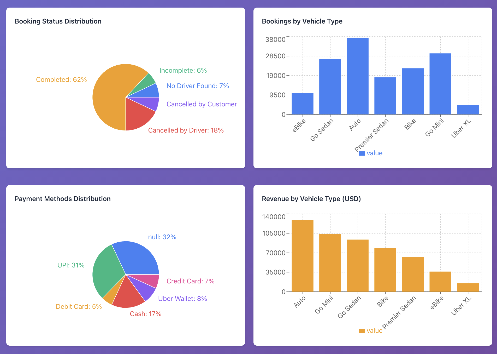
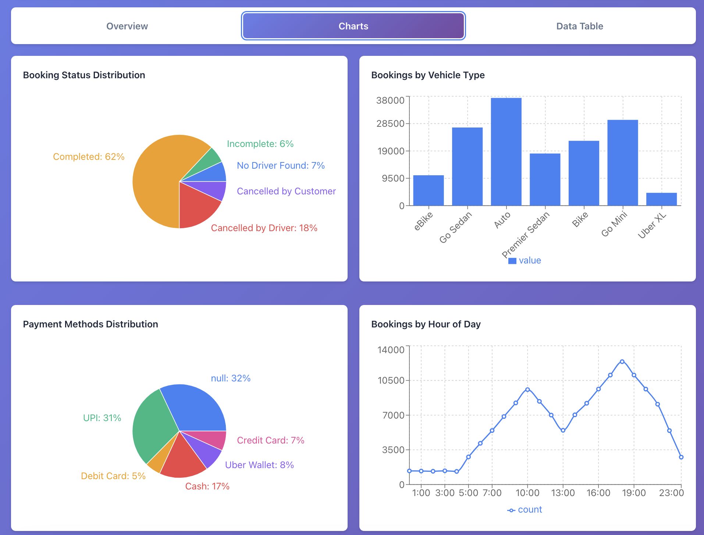
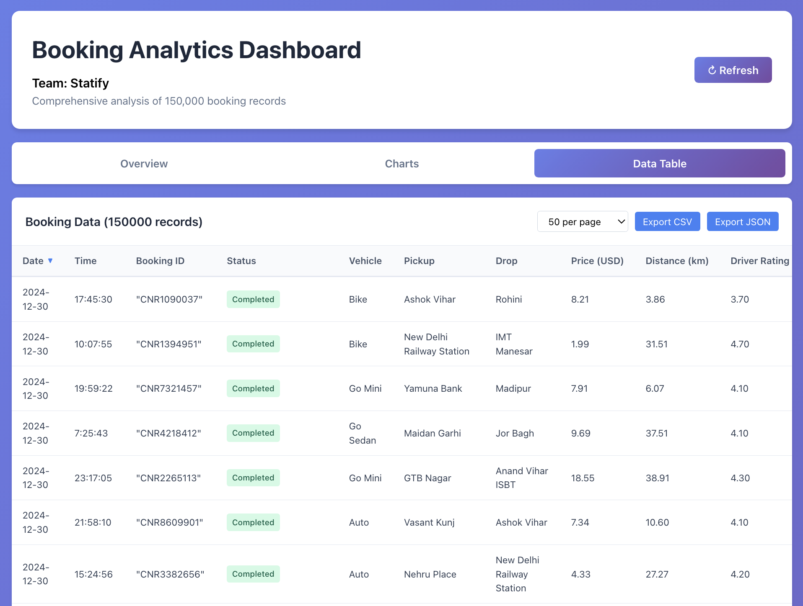
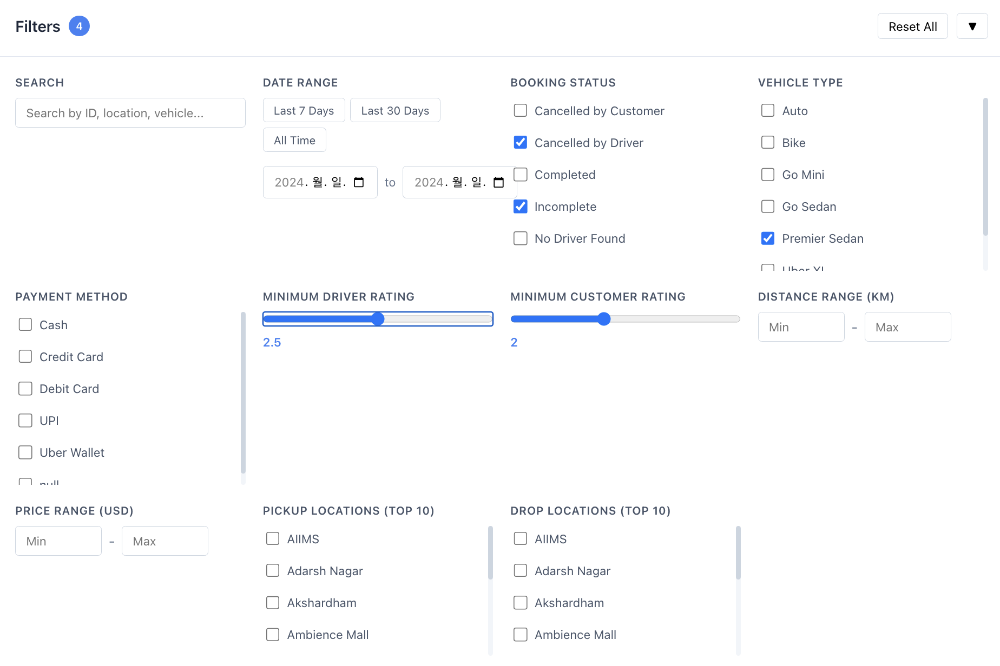

# Statify

차량 예약 데이터 분석 및 시각화 프로젝트

## 프로젝트 소개

Statify는 차량 예약 데이터를 분석하고 시각화하는 오픈소스 프로젝트입니다. Python 기반의 데이터 분석 도구와 React 기반의 인터랙티브 웹 대시보드를 제공하여 예약 데이터의 패턴과 인사이트를 발견할 수 있습니다.

## 팀 정보

**팀명**: Statify

**구성원**:
| 이름 | GitHub ID |
|------|-----------|
| 이가은 | [@rriver2](https://github.com/rriver2) |
| 문준영 | [@Imygo](https://github.com/Imygo) |
| LIU ZHIHAO | [@keria777-eng](https://github.com/keria777-eng) |

**과정**: 오픈소스 소프트웨어 수업 프로젝트

## 프로젝트 구조

```
statify-opensource-software/
├── statify-ulber/          # React 웹 애플리케이션
│   ├── src/
│   │   ├── components/     # UI 컴포넌트
│   │   │   ├── Charts.jsx
│   │   │   ├── DataTable.jsx
│   │   │   ├── FilterPanel.jsx
│   │   │   └── StatsCard.jsx
│   │   ├── utils/          # 유틸리티 함수
│   │   │   ├── dataLoader.js
│   │   │   ├── exportUtils.js
│   │   │   ├── filterUtils.js
│   │   │   └── statsUtils.js
│   │   └── App.jsx
│   └── package.json
├── dataChart/              # Python 데이터 분석
│   ├── Cancellation_Counts_by_Timezone.py
│   ├── Incomplete_Rides_by_Vehicle_Breakdown.py
│   ├── data-category.py
│   ├── gaeunLeeTimeZone.py
│   ├── gaeunLeeVisual.py
│   ├── booking_data_default.csv
│   └── result/
└── booking_data_converted.csv
```

## 주요 기능

### 1. statify-ulber (웹 대시보드)

React 기반의 인터랙티브 데이터 시각화 대시보드입니다.


**기능**:
- CSV 데이터 로딩 및 파싱
- 실시간 데이터 필터링
- 다양한 차트 시각화:
  - 예약 상태별 분포
  - 차량 유형별 분포
  - 결제 수단별 분포
  - 시간대별 예약 추이
  - 주요 위치 분석
  - 차량 유형별 수익 분석
- 통계 카드 (총 예약, 완료율, 총 수익 등)
- 데이터 테이블 뷰
- CSV 내보내기 기능

**기술 스택**:
- React 19
- Vite (빌드 도구)
- Recharts (차트 라이브러리)
- PapaParse (CSV 파싱)
- date-fns (날짜 처리)

#### 스크린샷

**차트 대시보드 - 1**



**차트 대시보드 - 2**



**데이터 테이블**



**필터 패널**



### 2. dataChart (데이터 분석)

Python 기반의 데이터 분석 및 시각화 스크립트입니다.

**분석 내용**:
- **타임존별 취소 건수 분석** (`Cancellation_Counts_by_Timezone.py`)
  - 지역별 취소 패턴 분석

- **차량 유형별 미완료 운행 분석** (`Incomplete_Rides_by_Vehicle_Breakdown.py`)
  - 차량 유형에 따른 미완료 운행 패턴 파악

- **데이터 카테고리 분류** (`data-category.py`)
  - 데이터 범주화 및 검증

- **타임존 분석** (`gaeunLeeTimeZone.py`)
  - 시간대별 데이터 분석

- **데이터 시각화** (`gaeunLeeVisual.py`)
  - 다양한 시각화 차트 생성

## 설치 및 실행

### 웹 대시보드 (statify-ulber)

```bash
# 디렉토리 이동
cd statify-ulber

# 의존성 설치
npm install

# 개발 서버 실행
npm run dev
```

브라우저에서 `http://localhost:5173` (기본 포트)로 접속합니다.

### 데이터 분석 (dataChart)

```bash
# 디렉토리 이동
cd dataChart

# Python 스크립트 실행 예시
python Cancellation_Counts_by_Timezone.py
python Incomplete_Rides_by_Vehicle_Breakdown.py
python data-category.py
python gaeunLeeTimeZone.py
python gaeunLeeVisual.py
```

**필요한 Python 패키지**:
- pandas
- matplotlib
- numpy
- (기타 필요한 패키지는 각 스크립트 내 import 문 참조)

## 데이터

프로젝트는 차량 예약 데이터를 사용합니다:
- `booking_data_converted.csv`: 변환된 예약 데이터
- `dataChart/booking_data_default.csv`: 기본 예약 데이터

**데이터 필드**:
- Booking_ID: 예약 ID
- Booking_Status: 예약 상태
- Vehicle_Type: 차량 유형
- Payment_Method: 결제 수단
- Booking_Time: 예약 시간
- Pickup_Location: 픽업 위치
- Dropoff_Location: 도착 위치
- Fare_Amount: 요금
- (기타 관련 필드)

## 개발 가이드

### 이슈 템플릿

프로젝트는 다음 이슈 템플릿을 제공합니다:
- 새로운 작업
- 기존 코드 개선
- 버그 리포트

자세한 내용은 `.github/ISSUE_TEMPLATE/` 디렉토리를 참조하세요.

### Pull Request 템플릿

PR 제출 시 `.github/PULL_REQUEST_TEMPLATE.md`의 가이드라인을 따라주세요.

## 라이선스

이 프로젝트는 오픈소스 소프트웨어 수업때 조별 과제로 개발되었습니다.

## 기여

이슈와 Pull Request를 환영합니다!

1. 이 저장소를 Fork 합니다
2. 새로운 브랜치를 생성합니다 (`git checkout -b feature/amazing-feature`)
3. 변경사항을 커밋합니다 (`git commit -m 'Add some amazing feature'`)
4. 브랜치에 Push 합니다 (`git push origin feature/amazing-feature`)
5. Pull Request를 생성합니다

## 문의

프로젝트 관련 문의사항은 이슈를 통해 남겨주세요.
